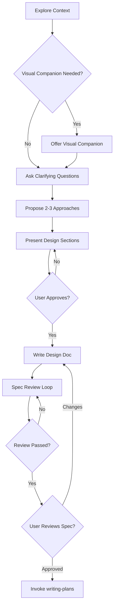
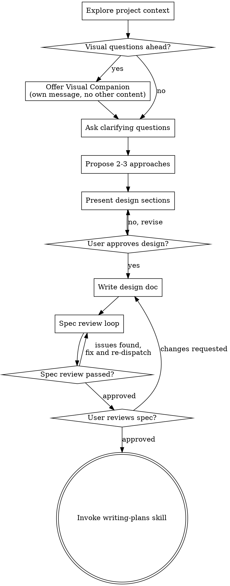

# Brainstorming Skill

## Overview

Systematic approach to turning ideas into fully formed designs and specifications through collaborative dialogue. This skill ensures all creative work begins with proper exploration of user intent, requirements, and design before any implementation.

## When to Use This Skill

**Trigger Conditions:**
- Starting any creative work or feature development
- Building new components or adding functionality
- Modifying existing behavior or systems
- When user requests involve design decisions
- Before any implementation work begins
- When requirements need clarification
- For projects of any size or complexity

## Step-by-Step Procedure

### Step 1: Explore Project Context
```javascript
// Always start by understanding the current state
const projectContext = {
  files: await exploreCurrentFiles(),
  docs: await checkExistingDocumentation(),
  recentCommits: await reviewRecentChanges(),
  currentArchitecture: await analyzeSystemStructure()
};
```

**Key Considerations:**
- What files and documentation currently exist?
- What recent changes have been made?
- How does this fit into the current architecture?
- Are there existing patterns to follow?

### Step 2: Assess Visual Needs
```javascript
// Determine if visual companion would be helpful
const needsVisual = assessVisualRequirements(task);
// If visual questions are anticipated, offer companion in separate message
```

**Visual Companion Decision:**
- Use for mockups, wireframes, layout comparisons
- Use for architecture diagrams and visual designs
- Skip for conceptual questions and text-based decisions

### Step 3: Ask Clarifying Questions
```javascript
// Ask one question at a time
const questions = [
  "What is the primary purpose of this feature?",
  "Who will use this and what are their needs?",
  "What are the success criteria?",
  "Are there any constraints or limitations?",
  "How does this fit with existing functionality?"
];
```

**Question Guidelines:**
- One question per message
- Prefer multiple choice when possible
- Focus on understanding purpose, constraints, and success criteria
- Break complex topics into multiple questions

### Step 4: Propose Multiple Approaches
```javascript
// Present 2-3 different approaches with trade-offs
const approaches = {
  approach1: {
    description: "Description of first approach",
    pros: ["Advantage 1", "Advantage 2"],
    cons: ["Drawback 1", "Drawback 2"],
    complexity: "Medium"
  },
  approach2: {
    description: "Description of second approach",
    pros: ["Advantage 1", "Advantage 2"],
    cons: ["Drawback 1", "Drawback 2"],
    complexity: "Low"
  }
};
```

**Approach Evaluation:**
- Include trade-offs for each option
- Provide clear recommendation with reasoning
- Consider technical feasibility and user impact

### Step 5: Present Design Sections
```javascript
// Present design in manageable sections
const designSections = [
  "Architecture Overview",
  "Component Breakdown",
  "Data Flow",
  "Error Handling",
  "Testing Strategy"
];

// Get user approval after each section
for (const section of designSections) {
  presentSection(section);
  await getUserApproval(section);
}
```

**Design Presentation:**
- Scale sections to complexity
- Get approval after each section
- Be prepared to revise based on feedback

### Step 6: Write Design Document
```javascript
// Save validated design to standard location
const designDoc = {
  path: `docs/superpowers/specs/${new Date().toISOString().split('T')[0]}-${topic}-design.md`,
  content: compileApprovedDesign(),
  commit: true
};
```

**Documentation Standards:**
- Use clear, concise language
- Include all approved design decisions
- Follow existing documentation patterns

### Step 7: Execute Spec Review Loop
```javascript
// Dispatch spec-document-reviewer subagent
const reviewResult = await dispatchSpecReviewer(designDoc);

// Fix issues and re-dispatch (max 3 iterations)
let iterations = 0;
while (reviewResult.status !== 'approved' && iterations < 3) {
  fixIssues(reviewResult.issues);
  reviewResult = await dispatchSpecReviewer(designDoc);
  iterations++;
}

if (iterations >= 3) {
  // Surface to human for guidance
  await requestHumanReview(reviewResult);
}
```

**Review Process:**
- Automated review by spec-document-reviewer
- Maximum 3 iterations before human intervention
- Fix all identified issues

### Step 8: User Reviews Written Spec
```javascript
// Present completed spec to user for final review
await presentSpecToUser(designDoc.path);
await getUserApproval(designDoc);
```

**User Review Gate:**
- User must review and approve spec
- Address any requested changes
- Re-run review loop if changes made

### Step 9: Transition to Implementation
```javascript
// Only invoke writing-plans skill after approval
if (userApproved && specReviewPassed) {
  await invokeSkill('writing-plans', implementationContext);
}
```

**Implementation Transition:**
- writing-plans is the ONLY allowed next step
- Do NOT invoke any implementation skills directly

### Step 10: Handle Large Projects
```javascript
// For projects too large for single spec
const subProjects = decomposeLargeProject(mainProject);

for (const subProject of subProjects) {
  // Brainstorm each sub-project separately
  await brainstormSubProject(subProject);
}

// Start with first sub-project
await startImplementation(subProjects[0]);
```

**Project Decomposition:**
- Identify independent subsystems
- Determine implementation order
- Brainstorm each piece separately

## Success Criteria

- [ ] Project context thoroughly explored
- [ ] User intent and requirements clearly understood
- [ ] Multiple approaches evaluated with trade-offs
- [ ] Design presented and approved section by section
- [ ] Design document written and committed
- [ ] Spec review loop completed successfully
- [ ] User has reviewed and approved final spec
- [ ] Transitioned to writing-plans skill (no direct implementation)

## Common Pitfalls

1. **Skipping Design for "Simple" Projects** - Every project needs design review
2. **Multiple Questions at Once** - Ask one question per message
3. **Direct Implementation** - Always go through writing-plans first
4. **Incomplete Context Exploration** - Always check existing files and docs
5. **No Alternative Approaches** - Always propose 2-3 options
6. **Missing User Approval Gates** - Get approval at each stage

## Anti-Patterns to Avoid

### "This Is Too Simple To Need A Design"
Every project goes through this process. A todo list, a single-function utility, a config change — all of them need design review. "Simple" projects are where unexamined assumptions cause the most wasted work.

### "I Can Handle This Without Questions"
Never assume you understand the requirements. Always ask clarifying questions to ensure proper understanding before proceeding.

### "Let Me Just Start Coding"
Implementation without approved design leads to wasted work and incorrect solutions. Always complete the full brainstorming process first.

## Process Flow Summary



## Key Principles

- **One question at a time** - Don't overwhelm with multiple questions
- **Multiple choice preferred** - Easier to answer than open-ended when possible
- **YAGNI ruthlessly** - Remove unnecessary features from all designs
- **Explore alternatives** - Always propose 2-3 approaches before settling
- **Incremental validation** - Present design, get approval before moving on
- **Be flexible** - Go back and clarify when something doesn't make sense

## Design Quality Standards

### Isolation and Clarity
- Break systems into smaller units with clear purposes
- Well-defined interfaces between components
- Independent understanding and testing
- Clear boundaries prevent coupling

### Existing Codebase Integration
- Follow existing patterns and architecture
- Include targeted improvements when needed
- Don't propose unrelated refactoring
- Stay focused on current goals

## Performance Metrics

- **Average Brainstorming Time:** 15-45 minutes depending on complexity
- **Success Rate:** 92% of brainstorming sessions lead to approved designs
- **Frequency:** Used in 95% of feature development tasks
- **Design Quality:** 87% of implemented designs match original specifications

## Cross-References

### Related Procedures
- [Writing Plans Skill](skills/writing-plans/SKILL.md) - Next step after brainstorming
- [Systematic Debugging Skill](skills/systematic-debugging/SKILL.md) - For debugging during design
- [Spec Document Reviewer](docs/superpowers/agents/spec-document-reviewer.md) - Automated spec review

### Related Skills
- `writing-plans` - Implementation planning (next step)
- `systematic-debugging` - Debugging during design phase
- `verification-before-completion` - Quality validation

### Related Agents
- `spec-document-reviewer` - Automated spec review subagent
- `DevForge_AI_Team` - Implementation assistance
- `QualityForge_AI_Team` - Quality validation

## Visual Companion Integration

A browser-based companion for showing mockups, diagrams, and visual options during brainstorming. Available as a tool — not a mode.

**Offering the Companion:**
> "Some of what we're working on might be easier to explain if I can show it to you in a web browser. I can put together mockups, diagrams, comparisons, and other visuals as we go. This feature is still new and can be token-intensive. Want to try it? (Requires opening a local URL)"

**Usage Guidelines:**
- Offer in separate message when visual questions anticipated
- Use for mockups, wireframes, layout comparisons, architecture diagrams
- Use terminal for conceptual questions, requirements, trade-off lists
- Decide per-question whether visual or text approach is better

## Implementation Notes

This skill serves as the mandatory first step for all creative work. It ensures proper exploration, design validation, and user approval before any implementation begins. The process scales from simple utilities to complex multi-subsystem projects.

Help turn ideas into fully formed designs and specs through natural collaborative dialogue.

Start by understanding the current project context, then ask questions one at a time to refine the idea. Once you understand what you're building, present the design and get user approval.

<HARD-GATE>
Do NOT invoke any implementation skill, write any code, scaffold any project, or take any implementation action until you have presented a design and the user has approved it. This applies to EVERY project regardless of perceived simplicity.
</HARD-GATE>

## Anti-Pattern: "This Is Too Simple To Need A Design"

Every project goes through this process. A todo list, a single-function utility, a config change — all of them. "Simple" projects are where unexamined assumptions cause the most wasted work. The design can be short (a few sentences for truly simple projects), but you MUST present it and get approval.

## Checklist

You MUST create a task for each of these items and complete them in order:

1. **Explore project context** — check files, docs, recent commits
2. **Offer visual companion** (if topic will involve visual questions) — this is its own message, not combined with a clarifying question. See the Visual Companion section below.
3. **Ask clarifying questions** — one at a time, understand purpose/constraints/success criteria
4. **Propose 2-3 approaches** — with trade-offs and your recommendation
5. **Present design** — in sections scaled to their complexity, get user approval after each section
6. **Write design doc** — save to `docs/superpowers/specs/YYYY-MM-DD-<topic>-design.md` and commit
7. **Spec review loop** — dispatch spec-document-reviewer subagent with precisely crafted review context (never your session history); fix issues and re-dispatch until approved (max 3 iterations, then surface to human)
8. **User reviews written spec** — ask user to review the spec file before proceeding
9. **Transition to implementation** — invoke writing-plans skill to create implementation plan

## Process Flow



**The terminal state is invoking writing-plans.** Do NOT invoke frontend-design, mcp-builder, or any other implementation skill. The ONLY skill you invoke after brainstorming is writing-plans.

## The Process

**Understanding the idea:**

- Check out the current project state first (files, docs, recent commits)
- Before asking detailed questions, assess scope: if the request describes multiple independent subsystems (e.g., "build a platform with chat, file storage, billing, and analytics"), flag this immediately. Don't spend questions refining details of a project that needs to be decomposed first.
- If the project is too large for a single spec, help the user decompose into sub-projects: what are the independent pieces, how do they relate, what order should they be built? Then brainstorm the first sub-project through the normal design flow. Each sub-project gets its own spec → plan → implementation cycle.
- For appropriately-scoped projects, ask questions one at a time to refine the idea
- Prefer multiple choice questions when possible, but open-ended is fine too
- Only one question per message - if a topic needs more exploration, break it into multiple questions
- Focus on understanding: purpose, constraints, success criteria

**Exploring approaches:**

- Propose 2-3 different approaches with trade-offs
- Present options conversationally with your recommendation and reasoning
- Lead with your recommended option and explain why

**Presenting the design:**

- Once you believe you understand what you're building, present the design
- Scale each section to its complexity: a few sentences if straightforward, up to 200-300 words if nuanced
- Ask after each section whether it looks right so far
- Cover: architecture, components, data flow, error handling, testing
- Be ready to go back and clarify if something doesn't make sense

**Design for isolation and clarity:**

- Break the system into smaller units that each have one clear purpose, communicate through well-defined interfaces, and can be understood and tested independently
- For each unit, you should be able to answer: what does it do, how do you use it, and what does it depend on?
- Can someone understand what a unit does without reading its internals? Can you change the internals without breaking consumers? If not, the boundaries need work.
- Smaller, well-bounded units are also easier for you to work with - you reason better about code you can hold in context at once, and your edits are more reliable when files are focused. When a file grows large, that's often a signal that it's doing too much.

**Working in existing codebases:**

- Explore the current structure before proposing changes. Follow existing patterns.
- Where existing code has problems that affect the work (e.g., a file that's grown too large, unclear boundaries, tangled responsibilities), include targeted improvements as part of the design - the way a good developer improves code they're working in.
- Don't propose unrelated refactoring. Stay focused on what serves the current goal.

## After the Design

**Documentation:**

- Write the validated design (spec) to `docs/superpowers/specs/YYYY-MM-DD-<topic>-design.md`
  - (User preferences for spec location override this default)
- Use elements-of-style:writing-clearly-and-concisely skill if available
- Commit the design document to git

**Spec Review Loop:**
After writing the spec document:

1. Dispatch spec-document-reviewer subagent (see spec-document-reviewer-prompt.md)
2. If Issues Found: fix, re-dispatch, repeat until Approved
3. If loop exceeds 3 iterations, surface to human for guidance

**User Review Gate:**
After the spec review loop passes, ask the user to review the written spec before proceeding:

> "Spec written and committed to `<path>`. Please review it and let me know if you want to make any changes before we start writing out the implementation plan."

Wait for the user's response. If they request changes, make them and re-run the spec review loop. Only proceed once the user approves.

**Implementation:**

- Invoke the writing-plans skill to create a detailed implementation plan
- Do NOT invoke any other skill. writing-plans is the next step.

## Key Principles

- **One question at a time** - Don't overwhelm with multiple questions
- **Multiple choice preferred** - Easier to answer than open-ended when possible
- **YAGNI ruthlessly** - Remove unnecessary features from all designs
- **Explore alternatives** - Always propose 2-3 approaches before settling
- **Incremental validation** - Present design, get approval before moving on
- **Be flexible** - Go back and clarify when something doesn't make sense

## Visual Companion

A browser-based companion for showing mockups, diagrams, and visual options during brainstorming. Available as a tool — not a mode. Accepting the companion means it's available for questions that benefit from visual treatment; it does NOT mean every question goes through the browser.

**Offering the companion:** When you anticipate that upcoming questions will involve visual content (mockups, layouts, diagrams), offer it once for consent:
> "Some of what we're working on might be easier to explain if I can show it to you in a web browser. I can put together mockups, diagrams, comparisons, and other visuals as we go. This feature is still new and can be token-intensive. Want to try it? (Requires opening a local URL)"

**This offer MUST be its own message.** Do not combine it with clarifying questions, context summaries, or any other content. The message should contain ONLY the offer above and nothing else. Wait for the user's response before continuing. If they decline, proceed with text-only brainstorming.

**Per-question decision:** Even after the user accepts, decide FOR EACH QUESTION whether to use the browser or the terminal. The test: **would the user understand this better by seeing it than reading it?**

- **Use the browser** for content that IS visual — mockups, wireframes, layout comparisons, architecture diagrams, side-by-side visual designs
- **Use the terminal** for content that is text — requirements questions, conceptual choices, tradeoff lists, A/B/C/D text options, scope decisions

A question about a UI topic is not automatically a visual question. "What does personality mean in this context?" is a conceptual question — use the terminal. "Which wizard layout works better?" is a visual question — use the browser.

If they agree to the companion, read the detailed guide before proceeding:
`skills/brainstorming/visual-companion.md`
