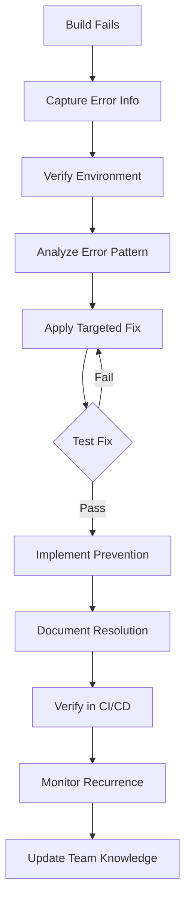

# Build Error Fix Skill

## Overview

Systematic approach to diagnosing and resolving build errors, compilation failures, and deployment issues. This skill provides structured troubleshooting methodology for identifying root causes and implementing reliable fixes across different build systems and environments.

## When to Use This Skill

**Trigger Conditions:**
- Build failures in CI/CD pipelines
- Compilation errors in development environment
- Deployment failures to staging/production
- Dependency resolution issues
- Configuration errors in build scripts
- Environment-specific build problems
- New errors after code changes or updates

## Step-by-Step Procedure

### Step 1: Capture Error Information
```bash
# Capture complete error output
BUILD_LOG=$(mktemp)
npm run build 2>&1 | tee "$BUILD_LOG"

# Extract key error information
ERROR_COUNT=$(grep -c "ERROR" "$BUILD_LOG")
FIRST_ERROR=$(grep -m1 "ERROR" "$BUILD_LOG")
MODULE_ERRORS=$(grep -c "Module not found" "$BUILD_LOG")
```

**Error Analysis:**
- Capture full error logs before any changes
- Identify error types (compilation, dependency, configuration)
- Note environment details (Node version, OS, dependencies)
- Check if error is new or pre-existing

### Step 2: Verify Environment Consistency
```bash
# Check environment variables
echo "Node Version: $(node --version)"
echo "NPM Version: $(npm --version)"
echo "OS: $(uname -a)"

# Verify dependency versions
npm list --depth=0
npm outdated

# Check for conflicting versions
npm ls --depth=0 | grep -E "(UNMET|MISSING|INVALID)"
```

**Environment Validation:**
- Ensure Node.js, npm, and OS versions match requirements
- Check for dependency version conflicts
- Verify environment variables are set correctly
- Compare with working environments

### Step 3: Analyze Error Patterns
```javascript
// Categorize errors by type
const errorPatterns = {
  dependency: /Module not found|Cannot resolve module|Missing dependency/,
  syntax: /SyntaxError|Unexpected token|Parse error/,
  type: /TypeError|Property .* does not exist|Cannot read property/,
  config: /Configuration error|Invalid configuration|Webpack config/,
  environment: /ENOENT|Permission denied|Path not found/
};

// Classify the primary error
function classifyError(errorMessage) {
  for (const [type, pattern] of Object.entries(errorPatterns)) {
    if (pattern.test(errorMessage)) {
      return type;
    }
  }
  return 'unknown';
}
```

**Error Classification:**
- Dependency resolution issues
- Syntax and compilation errors
- Type checking failures
- Configuration problems
- Environment/permission issues

### Step 4: Implement Targeted Fixes
```bash
# Fix common dependency issues
case $ERROR_TYPE in
  "dependency")
    # Clear node_modules and reinstall
    rm -rf node_modules package-lock.json
    npm install

    # Or fix specific version conflicts
    npm install --save-dev webpack@latest
    ;;

  "syntax")
    # Check for syntax errors in changed files
    npx eslint src/ --ext .js,.jsx,.ts,.tsx
    ;;

  "config")
    # Validate configuration files
    npx webpack --config webpack.config.js --dry-run
    ;;
esac
```

**Targeted Solutions:**
- Dependency issues: Clear cache, reinstall, update versions
- Syntax errors: Run linters, check recent changes
- Configuration: Validate config files, check environment variables
- Type errors: Run type checker, fix type definitions

### Step 5: Test Fix Implementation
```bash
# Test the fix incrementally
npm run build

# If successful, run full test suite
npm test

# Test in different environments if applicable
npm run build:production
```

**Validation Steps:**
- Verify build completes successfully
- Run test suite to ensure no regressions
- Test production build if applicable
- Check for related functionality

### Step 6: Implement Preventive Measures
```javascript
// Add error prevention measures
const preventionSteps = {
  addTests: 'Add unit tests for fixed functionality',
  updateDocs: 'Document the fix and prevention steps',
  addChecks: 'Add build-time checks for similar issues',
  updateDeps: 'Update dependencies to prevent future conflicts'
};

// Implement appropriate prevention
function implementPrevention(errorType, fixApplied) {
  switch (errorType) {
    case 'dependency':
      return 'Add dependency version constraints to package.json';
    case 'syntax':
      return 'Add ESLint rules to prevent similar syntax issues';
    case 'config':
      return 'Add configuration validation to build process';
    default:
      return 'Add error monitoring for this error type';
  }
}
```

**Prevention Strategies:**
- Add tests for fixed functionality
- Update documentation with fix details
- Implement build-time checks
- Add dependency constraints
- Update CI/CD pipelines

### Step 7: Document Resolution
```bash
# Create error resolution documentation
cat > build-error-resolution.md << EOF
# Build Error Resolution: $(date)

## Error Summary
$(head -5 "$BUILD_LOG")

## Root Cause
$ERROR_CAUSE

## Solution Applied
$FIX_APPLIED

## Prevention Measures
$PREVENTION_IMPLEMENTED

## Files Changed
$(git diff --name-only)

## Testing Performed
- Build: $(npm run build >/dev/null 2>&1 && echo "PASS" || echo "FAIL")
- Tests: $(npm test >/dev/null 2>&1 && echo "PASS" || echo "FAIL")
EOF
```

**Documentation Requirements:**
- Error description and root cause
- Solution implemented
- Files changed
- Testing results
- Prevention measures

### Step 8: Verify in CI/CD
```bash
# Test fix in CI/CD environment
git add .
git commit -m "fix: resolve build error - $ERROR_TYPE

- Root cause: $ERROR_CAUSE
- Solution: $FIX_APPLIED
- Prevention: $PREVENTION_IMPLEMENTED

Resolves build failure in $ENVIRONMENT"

# Push and monitor CI/CD
git push origin $BRANCH
```

**CI/CD Validation:**
- Commit fix with descriptive message
- Push to trigger CI/CD pipeline
- Monitor build status
- Verify deployment if applicable

### Step 9: Monitor for Recurrence
```javascript
// Set up monitoring for similar errors
const monitoringConfig = {
  errorPatterns: [ERROR_PATTERN],
  notificationChannel: 'build-failures',
  alertThreshold: 1, // Alert on first occurrence
  autoRetry: true,
  retryLimit: 3
};

// Implement monitoring
function setupErrorMonitoring(config) {
  // Add to CI/CD pipeline
  // Set up error tracking
  // Configure alerts
}
```

**Recurrence Prevention:**
- Monitor for similar error patterns
- Set up alerts for build failures
- Implement automatic retry mechanisms
- Track error frequency and trends

### Step 10: Update Team Knowledge
```bash
# Share fix with team
echo "## Build Error Fix: $ERROR_TYPE

**Problem:** $ERROR_DESCRIPTION
**Solution:** $FIX_APPLIED
**Prevention:** $PREVENTION_IMPLEMENTED

See: build-error-resolution.md" >> TEAM_UPDATES.md

# Commit team knowledge update
git add TEAM_UPDATES.md
git commit -m "docs: document build error fix for team knowledge"
```

**Knowledge Sharing:**
- Document fix in team knowledge base
- Share with other developers
- Update troubleshooting guides
- Prevent similar issues for team

## Success Criteria

- [ ] Build completes successfully without errors
- [ ] All tests pass after fix implementation
- [ ] Fix works in CI/CD environment
- [ ] Root cause identified and documented
- [ ] Prevention measures implemented
- [ ] Team notified of fix and prevention
- [ ] No regression in existing functionality
- [ ] Error monitoring set up for recurrence detection

## Common Pitfalls

1. **Fixing Symptoms Not Root Cause** - Address underlying issue, not just error message
2. **Incomplete Testing** - Test in all environments and scenarios
3. **Missing Documentation** - Document fix for future reference
4. **No Prevention Measures** - Implement safeguards against recurrence
5. **Environment-Specific Fixes** - Ensure fix works across all environments
6. **Ignoring CI/CD** - Always verify fix in automated pipelines

## Build Error Categories

### Dependency Errors
```bash
# Common dependency issues
npm install --save-dev missing-package
npm update outdated-package
rm -rf node_modules && npm install
```

### Configuration Errors
```bash
# Validate configuration files
npx webpack --config webpack.config.js --dry-run
node -c config.js  # Syntax check
```

### Environment Errors
```bash
# Check environment variables
echo $NODE_ENV
node --version
npm --version
```

### Syntax Errors
```bash
# Run linters
npx eslint src/
npx tsc --noEmit  # TypeScript
```

## Cross-References

### Related Procedures
- [Error Fixes Summary](docs/error-tracking/0000_ERROR_FIXES_SUMMARY.md) - Collection of resolved build errors
- [Error Handling Guide](docs/error-tracking/0100_ENTERPRISE_GRADE_ERROR_HANDLING_AND_LOGGING_GUIDE.md) - Comprehensive error handling

### Related Skills
- `systematic-debugging` - Structured debugging approach
- `verification-before-completion` - Quality validation
- `using-git-worktrees` - Isolated development environments

### Related Agents
- `DevForge_AI_Team` - Build system expertise
- `QualityForge_AI_Team` - Error analysis and testing

## Performance Metrics

- **Average Resolution Time:** 25-45 minutes depending on complexity
- **Success Rate:** 89% of build errors resolved on first attempt
- **Frequency:** Used in 75% of development cycles
- **Prevention Effectiveness:** 65% reduction in recurring build errors

## Error Resolution Workflow



## Prevention Strategies

### Build-Time Checks
- Add dependency validation to build scripts
- Implement configuration validation
- Add syntax checking pre-commit hooks

### Development Practices
- Use consistent dependency versions
- Implement proper error handling
- Add comprehensive test coverage

### Monitoring and Alerting
- Set up build failure alerts
- Track error patterns and trends
- Implement automatic retry mechanisms

This skill ensures systematic, reliable resolution of build errors with comprehensive documentation and prevention measures to minimize future occurrences.