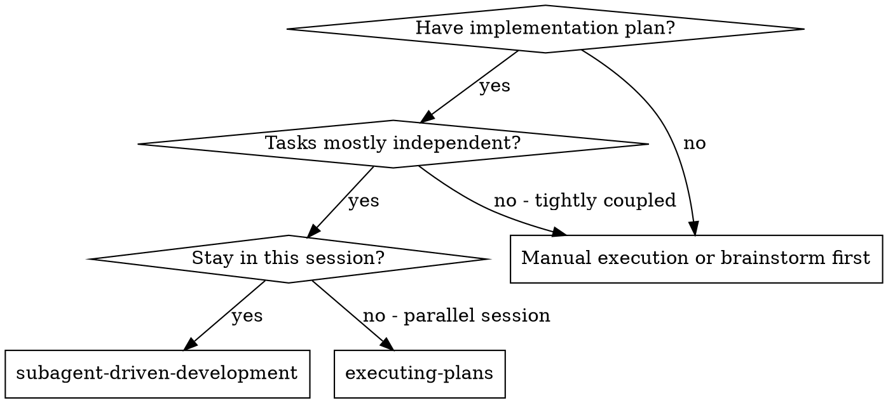
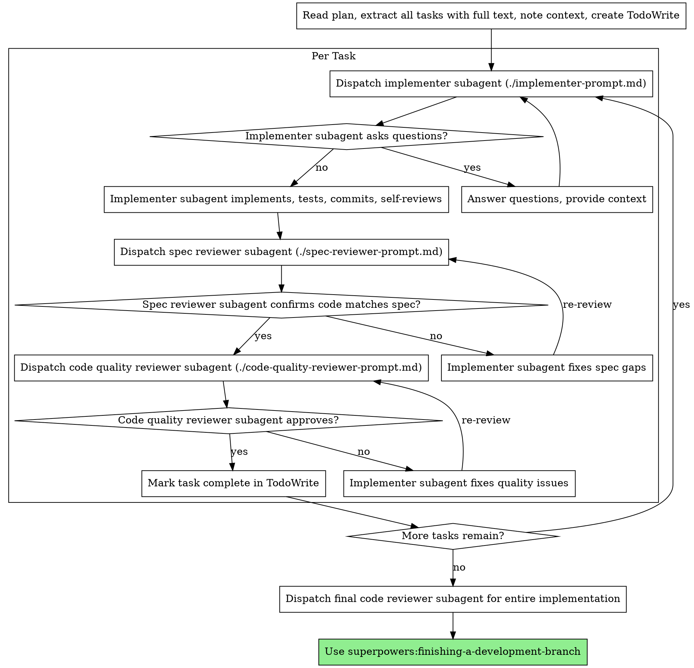

# Subagent-Driven Development

## Overview

Execute plan by dispatching fresh subagent per task, with two-stage review after each: spec compliance review first, then code quality review.

**Why subagents:** You delegate tasks to specialized agents with isolated context. By precisely crafting their instructions and context, you ensure they stay focused and succeed at their task. They should never inherit your session's context or history — you construct exactly what they need. This also preserves your own context for coordination work.

**Core principle:** Fresh subagent per task + two-stage review (spec then quality) = high quality, fast iteration

## When to Use



**vs. Executing Plans (parallel session):**
- Same session (no context switch)
- Fresh subagent per task (no context pollution)
- Two-stage review after each task: spec compliance first, then code quality
- Faster iteration (no human-in-loop between tasks)

## The Process



## Model Selection

Use the least powerful model that can handle each role to conserve cost and increase speed.

**Mechanical implementation tasks** (isolated functions, clear specs, 1-2 files): use a fast, cheap model. Most implementation tasks are mechanical when the plan is well-specified.

**Integration and judgment tasks** (multi-file coordination, pattern matching, debugging): use a standard model.

**Architecture, design, and review tasks**: use the most capable available model.

**Task complexity signals:**
- Touches 1-2 files with a complete spec → cheap model
- Touches multiple files with integration concerns → standard model
- Requires design judgment or broad codebase understanding → most capable model

## Handling Implementer Status

Implementer subagents report one of four statuses. Handle each appropriately:

**DONE:** Proceed to spec compliance review.

**DONE_WITH_CONCERNS:** The implementer completed the work but flagged doubts. Read the concerns before proceeding. If the concerns are about correctness or scope, address them before review. If they're observations (e.g., "this file is getting large"), note them and proceed to review.

**NEEDS_CONTEXT:** The implementer needs information that wasn't provided. Provide the missing context and re-dispatch.

**BLOCKED:** The implementer cannot complete the task. Assess the blocker:
1. If it's a context problem, provide more context and re-dispatch with the same model
2. If the task requires more reasoning, re-dispatch with a more capable model
3. If the task is too large, break it into smaller pieces
4. If the plan itself is wrong, escalate to the human

**Never** ignore an escalation or force the same model to retry without changes. If the implementer said it's stuck, something needs to change.

## Prompt Templates

- `./implementer-prompt.md` - Dispatch implementer subagent
- `./spec-reviewer-prompt.md` - Dispatch spec compliance reviewer subagent
- `./code-quality-reviewer-prompt.md` - Dispatch code quality reviewer subagent

## Example Workflow

```
You: I'm using Subagent-Driven Development to execute this plan.

[Read plan file once: docs/superpowers/plans/feature-plan.md]
[Extract all 5 tasks with full text and context]
[Create TodoWrite with all tasks]

Task 1: Hook installation script

[Get Task 1 text and context (already extracted)]
[Dispatch implementation subagent with full task text + context]

Implementer: "Before I begin - should the hook be installed at user or system level?"

You: "User level (~/.config/superpowers/hooks/)"

Implementer: "Got it. Implementing now..."
[Later] Implementer:
  - Implemented install-hook command
  - Added tests, 5/5 passing
  - Self-review: Found I missed --force flag, added it
  - Committed

[Dispatch spec compliance reviewer]
Spec reviewer: ✅ Spec compliant - all requirements met, nothing extra

[Get git SHAs, dispatch code quality reviewer]
Code reviewer: Strengths: Good test coverage, clean. Issues: None. Approved.

[Mark Task 1 complete]

Task 2: Recovery modes

[Get Task 2 text and context (already extracted)]
[Dispatch implementation subagent with full task text + context]

Implementer: [No questions, proceeds]
Implementer:
  - Added verify/repair modes
  - 8/8 tests passing
  - Self-review: All good
  - Committed

[Dispatch spec compliance reviewer]
Spec reviewer: ❌ Issues:
  - Missing: Progress reporting (spec says "report every 100 items")
  - Extra: Added --json flag (not requested)

[Implementer fixes issues]
Implementer: Removed --json flag, added progress reporting

[Spec reviewer reviews again]
Spec reviewer: ✅ Spec compliant now

[Dispatch code quality reviewer]
Code reviewer: Strengths: Solid. Issues (Important): Magic number (100)

[Implementer fixes]
Implementer: Extracted PROGRESS_INTERVAL constant

[Code reviewer reviews again]
Code reviewer: ✅ Approved

[Mark Task 2 complete]

...

[After all tasks]
[Dispatch final code-reviewer]
Final reviewer: All requirements met, ready to merge

Done!
```

## Advantages

**vs. Manual execution:**
- Subagents follow TDD naturally
- Fresh context per task (no confusion)
- Parallel-safe (subagents don't interfere)
- Subagent can ask questions (before AND during work)

**vs. Executing Plans:**
- Same session (no handoff)
- Continuous progress (no waiting)
- Review checkpoints automatic

**Efficiency gains:**
- No file reading overhead (controller provides full text)
- Controller curates exactly what context is needed
- Subagent gets complete information upfront
- Questions surfaced before work begins (not after)

**Quality gates:**
- Self-review catches issues before handoff
- Two-stage review: spec compliance, then code quality
- Review loops ensure fixes actually work
- Spec compliance prevents over/under-building
- Code quality ensures implementation is well-built

**Cost:**
- More subagent invocations (implementer + 2 reviewers per task)
- Controller does more prep work (extracting all tasks upfront)
- Review loops add iterations
- But catches issues early (cheaper than debugging later)

## Red Flags

**Never:**
- Start implementation on main/master branch without explicit user consent
- Skip reviews (spec compliance OR code quality)
- Proceed with unfixed issues
- Dispatch multiple implementation subagents in parallel (conflicts)
- Make subagent read plan file (provide full text instead)
- Skip scene-setting context (subagent needs to understand where task fits)
- Ignore subagent questions (answer before letting them proceed)
- Accept "close enough" on spec compliance (spec reviewer found issues = not done)
- Skip review loops (reviewer found issues = implementer fixes = review again)
- Let implementer self-review replace actual review (both are needed)
- **Start code quality review before spec compliance is ✅** (wrong order)
- Move to next task while either review has open issues

**If subagent asks questions:**
- Answer clearly and completely
- Provide additional context if needed
- Don't rush them into implementation

**If reviewer finds issues:**
- Implementer (same subagent) fixes them
- Reviewer reviews again
- Repeat until approved
- Don't skip the re-review

**If subagent fails task:**
- Dispatch fix subagent with specific instructions
- Don't try to fix manually (context pollution)

## When to Use This Skill

**Trigger Conditions:**
- After creating a comprehensive implementation plan using writing-plans skill
- When tasks are mostly independent and can be executed in parallel
- When staying in the current session for continuous development
- When high-quality implementation with systematic reviews is required
- When delegating implementation work to specialized AI agents
- When two-stage review process (spec compliance + code quality) is beneficial
- When fresh context per task prevents confusion and errors
- When subagent support is available for enhanced development workflow

**Prerequisites:**
- Approved implementation plan from writing-plans skill
- Clean worktree environment (not main/master branch)
- Access to subagent capabilities for task delegation
- Understanding of plan requirements and acceptance criteria

## Step-by-Step Procedure

### Step 1: Plan Preparation and Task Extraction
**Prepare the development environment and extract all tasks:**

```javascript
// Read and analyze the implementation plan
const planDocument = await loadPlanDocument(planPath);
const planAnalysis = analyzePlanStructure(planDocument);

if (!planAnalysis.isValid) {
  throw new Error(`Invalid plan: ${planAnalysis.issues.join(', ')}`);
}

// Extract all tasks with complete context
const extractedTasks = planDocument.tasks.map(task => ({
  id: task.id,
  title: task.title,
  description: task.description,
  requirements: task.requirements,
  files: task.files,
  context: extractTaskContext(task, planDocument),
  dependencies: identifyTaskDependencies(task, planDocument)
}));

// Create task tracking system
const taskTracker = new TaskTracker(extractedTasks);
taskTracker.initializeTodoWrite();
```

**Preparation Requirements:**
- Complete plan document loaded and validated
- All tasks extracted with full context and requirements
- Task dependencies identified and mapped
- TodoWrite system initialized for progress tracking

### Step 2: Model Selection and Resource Allocation
**Select appropriate AI models for each role based on task complexity:**

```javascript
// Model selection strategy
const modelSelection = {
  implementer: selectImplementerModel(taskComplexity),
  specReviewer: 'most-capable', // Always use best for spec compliance
  qualityReviewer: 'most-capable', // Always use best for code quality
  finalReviewer: 'most-capable' // Always use best for overall assessment
};

function selectImplementerModel(complexity) {
  if (complexity === 'mechanical') return 'fast-cheap'; // 1-2 files, clear spec
  if (complexity === 'integration') return 'standard'; // Multi-file coordination
  if (complexity === 'architectural') return 'most-capable'; // Design judgment needed
  return 'standard'; // Default
}

// Validate subagent availability
const subagentCapabilities = await checkSubagentAvailability();
if (!subagentCapabilities.implementer || !subagentCapabilities.reviewer) {
  throw new Error('Required subagent capabilities not available');
}
```

**Model Selection Criteria:**
- Implementer: Based on task complexity and requirements
- Reviewers: Always use most capable models for quality assurance
- Cost optimization: Use least powerful model that can handle the task
- Availability verification: Ensure required subagent types are accessible

### Step 3: Task Execution Loop
**Execute each task with fresh subagent and two-stage review:**

```javascript
// Main execution loop
for (const task of extractedTasks) {
  console.log(`🚀 Starting Task ${task.id}: ${task.title}`);
  
  try {
    // Phase 1: Implementation
    const implementation = await executeTaskWithSubagent(task);
    
    // Phase 2: Spec Compliance Review
    const specReview = await performSpecComplianceReview(task, implementation);
    if (!specReview.compliant) {
      await fixSpecComplianceIssues(task, specReview.issues);
      // Re-review after fixes
      const reReview = await performSpecComplianceReview(task, implementation);
      if (!reReview.compliant) {
        throw new Error(`Spec compliance issues not resolved: ${reReview.issues}`);
      }
    }
    
    // Phase 3: Code Quality Review
    const qualityReview = await performCodeQualityReview(task, implementation);
    if (!qualityReview.approved) {
      await fixQualityIssues(task, qualityReview.issues);
      // Re-review after fixes
      const reReview = await performCodeQualityReview(task, implementation);
      if (!reReview.approved) {
        throw new Error(`Code quality issues not resolved: ${reReview.issues}`);
      }
    }
    
    // Mark task complete
    taskTracker.markTaskComplete(task.id);
    console.log(`✅ Task ${task.id} completed successfully`);
    
  } catch (error) {
    console.error(`❌ Task ${task.id} failed: ${error.message}`);
    await handleTaskFailure(task, error);
    // Decide whether to continue with other tasks or stop
    if (error.critical) {
      throw error; // Stop execution for critical failures
    }
  }
}
```

**Execution Flow:**
- Fresh subagent per task with isolated context
- Implementation phase with TDD methodology
- Two-stage review: spec compliance then code quality
- Review-fix-review loops until approval
- Comprehensive error handling and escalation

### Step 4: Subagent Coordination and Communication
**Manage subagent interactions and context provision:**

```javascript
// Subagent coordination system
class SubagentCoordinator {
  async dispatchImplementer(task) {
    const prompt = this.buildImplementerPrompt(task);
    const subagent = await this.createSubagent('implementer', task.model);
    
    // Handle questions before implementation
    const questions = await subagent.askClarifyingQuestions(prompt);
    if (questions.length > 0) {
      const answers = await this.getAnswersFromController(questions);
      prompt.context = { ...prompt.context, answers };
    }
    
    // Execute implementation
    const result = await subagent.execute(prompt);
    return this.processImplementationResult(result);
  }
  
  async dispatchReviewer(task, implementation, reviewType) {
    const prompt = this.buildReviewerPrompt(task, implementation, reviewType);
    const subagent = await this.createSubagent('reviewer', 'most-capable');
    
    const reviewResult = await subagent.execute(prompt);
    return this.processReviewResult(reviewResult, reviewType);
  }
  
  buildImplementerPrompt(task) {
    return {
      role: 'implementer',
      task: task.description,
      requirements: task.requirements,
      files: task.files,
      context: task.context,
      dependencies: task.dependencies,
      instructions: 'Follow TDD. Ask questions before implementing. Self-review before completion.'
    };
  }
  
  buildReviewerPrompt(task, implementation, reviewType) {
    if (reviewType === 'spec') {
      return {
        role: 'spec-reviewer',
        task: task.description,
        requirements: task.requirements,
        implementation: implementation,
        focus: 'Verify implementation matches specification exactly'
      };
    } else {
      return {
        role: 'quality-reviewer',
        implementation: implementation,
        standards: this.getCodeQualityStandards(),
        focus: 'Assess code quality, maintainability, and best practices'
      };
    }
  }
}
```

**Subagent Management:**
- Precise prompt construction for each role
- Question handling before implementation begins
- Context isolation to prevent confusion
- Result processing and status interpretation

### Step 5: Review Loop Management
**Handle review-fix-review cycles until approval:**

```javascript
// Review loop management
async function manageReviewLoop(task, implementation, reviewType) {
  let reviewResult;
  let iterations = 0;
  const maxIterations = 3;
  
  do {
    reviewResult = await dispatchReviewer(task, implementation, reviewType);
    
    if (!reviewResult.approved) {
      console.log(`🔄 Review found ${reviewResult.issues.length} issues, fixing...`);
      
      // Dispatch implementer to fix issues
      const fixes = await dispatchImplementerForFixes(task, reviewResult.issues);
      
      // Update implementation with fixes
      implementation = await applyFixes(implementation, fixes);
      
      iterations++;
    }
  } while (!reviewResult.approved && iterations < maxIterations);
  
  if (!reviewResult.approved) {
    throw new Error(`${reviewType} review failed after ${maxIterations} iterations`);
  }
  
  return reviewResult;
}

async function dispatchImplementerForFixes(task, issues) {
  const fixPrompt = {
    role: 'fixer',
    originalTask: task,
    issues: issues,
    instructions: 'Fix only the specified issues. Do not change other functionality.'
  };
  
  const fixerSubagent = await createSubagent('implementer', task.model);
  return await fixerSubagent.execute(fixPrompt);
}
```

**Review Loop Control:**
- Maximum 3 iterations per review type
- Implementer dispatched to fix identified issues
- Implementation updated with fixes
- Re-review after fixes applied

### Step 6: Error Handling and Escalation
**Manage subagent failures and execution blockers:**

```javascript
// Error handling and escalation
async function handleSubagentError(subagent, error, task) {
  const errorAnalysis = analyzeSubagentError(error);
  
  switch (errorAnalysis.type) {
    case 'needs_context':
      // Provide additional context and retry
      const additionalContext = await gatherAdditionalContext(errorAnalysis.requirements);
      return await retryWithAdditionalContext(subagent, task, additionalContext);
      
    case 'task_too_complex':
      // Use more capable model
      const upgradedModel = getUpgradedModel(task.model);
      return await retryWithUpgradedModel(subagent, task, upgradedModel);
      
    case 'task_too_large':
      // Break into smaller tasks
      const subTasks = await decomposeTask(task);
      return await executeSubTasks(subTasks);
      
    case 'plan_error':
      // Escalate to human for plan correction
      await escalateToHuman('Plan error detected', {
        task: task,
        error: error,
        analysis: errorAnalysis
      });
      throw new Error('Plan correction required');
      
    default:
      // Generic retry with same parameters
      return await retrySubagent(subagent, task);
  }
}

function analyzeSubagentError(error) {
  if (error.message.includes('missing context')) {
    return { type: 'needs_context', requirements: extractContextNeeds(error) };
  }
  if (error.message.includes('too complex')) {
    return { type: 'task_too_complex' };
  }
  if (error.message.includes('task too large')) {
    return { type: 'task_too_large' };
  }
  if (error.message.includes('plan inconsistency')) {
    return { type: 'plan_error' };
  }
  return { type: 'unknown' };
}
```

**Error Management:**
- Context provision for missing information
- Model upgrades for complex tasks
- Task decomposition for oversized work
- Human escalation for plan-level issues

### Step 7: Progress Tracking and Communication
**Maintain execution visibility and stakeholder communication:**

```javascript
// Progress tracking and communication
class ProgressTracker {
  constructor(totalTasks) {
    this.totalTasks = totalTasks;
    this.completedTasks = 0;
    this.failedTasks = 0;
    this.currentTask = null;
    this.startTime = Date.now();
  }
  
  startTask(task) {
    this.currentTask = task;
    this.broadcastProgress('task_started', {
      taskId: task.id,
      taskTitle: task.title,
      progress: this.getProgressPercentage()
    });
  }
  
  completeTask(task) {
    this.completedTasks++;
    this.currentTask = null;
    this.broadcastProgress('task_completed', {
      taskId: task.id,
      totalCompleted: this.completedTasks,
      progress: this.getProgressPercentage(),
      estimatedTimeRemaining: this.calculateTimeRemaining()
    });
  }
  
  failTask(task, error) {
    this.failedTasks++;
    this.broadcastProgress('task_failed', {
      taskId: task.id,
      error: error.message,
      requiresAttention: true
    });
  }
  
  getProgressPercentage() {
    return Math.round((this.completedTasks / this.totalTasks) * 100);
  }
  
  calculateTimeRemaining() {
    const elapsed = Date.now() - this.startTime;
    const avgTimePerTask = elapsed / this.completedTasks;
    const remainingTasks = this.totalTasks - this.completedTasks;
    return Math.round(avgTimePerTask * remainingTasks / 1000 / 60); // minutes
  }
  
  broadcastProgress(event, data) {
    console.log(`📊 ${event}: ${JSON.stringify(data, null, 2)}`);
    // Additional communication channels can be added here
  }
}
```

**Progress Management:**
- Real-time task status tracking
- Progress percentage calculations
- Time remaining estimates
- Stakeholder communication channels

### Step 8: Final Integration and Completion
**Complete all tasks and prepare for final integration:**

```javascript
// Final integration and completion
async function completeSubagentDevelopment(planDocument, progressTracker) {
  // Ensure all tasks completed successfully
  if (progressTracker.completedTasks !== progressTracker.totalTasks) {
    throw new Error(`Not all tasks completed: ${progressTracker.completedTasks}/${progressTracker.totalTasks}`);
  }
  
  // Perform final comprehensive review
  console.log('🎯 All tasks completed, performing final review...');
  const finalReview = await performFinalCodeReview(planDocument);
  
  if (!finalReview.approved) {
    throw new Error(`Final review failed: ${finalReview.issues.join(', ')}`);
  }
  
  // Generate completion summary
  const completionSummary = {
    totalTasks: progressTracker.totalTasks,
    executionTime: Date.now() - progressTracker.startTime,
    subagentsUsed: progressTracker.subagentsDispatched,
    reviewsPerformed: progressTracker.reviewsCompleted,
    finalStatus: 'ready_for_integration'
  };
  
  console.log('🎉 Subagent-driven development completed successfully!');
  console.log(`📈 Summary: ${JSON.stringify(completionSummary, null, 2)}`);
  
  // Transition to finishing skill
  await invokeSkill('finishing-a-development-branch', {
    completionSummary: completionSummary,
    planDocument: planDocument
  });
}
```

**Final Integration:**
- Verification of all task completion
- Final comprehensive code review
- Completion summary generation
- Clean handoff to finishing skill

## Success Criteria

- [ ] Implementation plan loaded and all tasks extracted
- [ ] Appropriate AI models selected for each role
- [ ] Fresh subagent dispatched for each task with isolated context
- [ ] Two-stage review (spec compliance + code quality) completed for each task
- [ ] Review-fix-review loops resolved all issues within iteration limits
- [ ] Subagent errors handled appropriately (context, model upgrade, decomposition)
- [ ] Progress tracked and communicated throughout execution
- [ ] All tasks completed successfully with approvals
- [ ] Final integration review passed
- [ ] Clean transition to finishing-a-development-branch skill

## Common Pitfalls

1. **Context Pollution** - Never share session history with subagents
2. **Skipping Reviews** - Always perform both spec and quality reviews
3. **Ignoring Questions** - Answer all subagent questions before implementation
4. **Wrong Model Selection** - Use appropriate model power for task complexity
5. **Parallel Conflicts** - Never dispatch multiple implementers simultaneously
6. **Incomplete Context** - Provide complete task information upfront
7. **Review Loop Abuse** - Respect maximum iteration limits

## Subagent Status Handling

### DONE Status
- Proceed immediately to spec compliance review
- No additional context needed

### DONE_WITH_CONCERNS Status
- Review concerns before proceeding
- Address correctness/scope concerns before review
- Note observations (file size, etc.) for later

### NEEDS_CONTEXT Status
- Provide requested additional context
- Re-dispatch with enhanced context
- Never proceed without addressing context needs

### BLOCKED Status
- Analyze blocker type (context, complexity, size, plan error)
- Apply appropriate resolution strategy
- Escalate to human for plan-level issues
- Never force retry with same parameters

## Quality Gates

### Spec Compliance Review
- Implementation matches requirements exactly
- No missing functionality
- No extra functionality (YAGNI)
- All edge cases handled

### Code Quality Review
- Clean, maintainable code
- Proper error handling
- Adequate test coverage
- Follows coding standards
- No security vulnerabilities

### Final Integration Review
- All components work together
- No regressions introduced
- Performance requirements met
- Documentation updated

## Cross-References

### Related Procedures
- [Writing Plans Skill](skills/writing-plans/SKILL.md) - Creates plans for subagent execution
- [Executing Plans Skill](skills/executing-plans/SKILL.md) - Alternative execution method
- [Requesting Code Review Skill](skills/requesting-code-review/SKILL.md) - Review subagent templates
- [Finishing Development Branch Skill](skills/finishing-a-development-branch/SKILL.md) - Completion workflow

### Related Skills
- `writing-plans` - Plan creation prerequisite
- `executing-plans` - Alternative when subagents unavailable
- `requesting-code-review` - Review process integration
- `finishing-a-development-branch` - Required completion skill
- `test-driven-development` - Methodology used by subagents

### Related Agents
- `DevForge_AI_Team` - Implementation subagent provider
- `QualityForge_AI_Team` - Code review subagent provider
