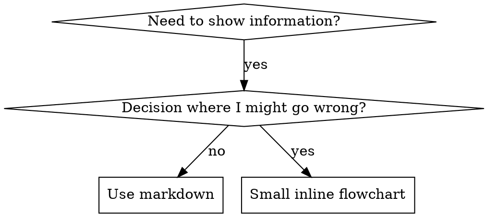

# Writing Skills

## Overview

**Writing skills IS Test-Driven Development applied to process documentation.**

**Personal skills live in agent-specific directories (`~/.claude/skills` for Claude Code, `~/.agents/skills/` for Codex)** 

You write test cases (pressure scenarios with subagents), watch them fail (baseline behavior), write the skill (documentation), watch tests pass (agents comply), and refactor (close loopholes).

**Core principle:** If you didn't watch an agent fail without the skill, you don't know if the skill teaches the right thing.

**REQUIRED BACKGROUND:** You MUST understand superpowers:test-driven-development before using this skill. That skill defines the fundamental RED-GREEN-REFACTOR cycle. This skill adapts TDD to documentation.

**Official guidance:** For Anthropic's official skill authoring best practices, see anthropic-best-practices.md. This document provides additional patterns and guidelines that complement the TDD-focused approach in this skill.

## When to Use This Skill

**Trigger Conditions:**
- When creating new skills for the superpowers framework
- When editing or updating existing skills
- When verifying that skills work correctly before deployment
- When documenting proven techniques, patterns, or tools
- When creating reusable reference guides for future use
- When establishing standardized approaches to common problems
- When building documentation that future AI instances can discover and apply

**Prerequisites:**
- Understanding of test-driven development principles
- Access to subagent capabilities for testing
- Knowledge of the superpowers framework structure
- Experience with the specific technique being documented

## Step-by-Step Procedure

### Step 1: Assess Skill Creation Need
**Determine if a skill is the right approach for the documentation:**

```javascript
// Evaluate documentation needs
const documentationAssessment = {
  isTechnique: checkIfProvenTechnique(technique),
  isReusable: assessReusabilityAcrossProjects(technique),
  isPattern: evaluateMentalModelValue(technique),
  isReference: checkReferenceGuideValue(technique),
  hasBroadApplicability: assessCrossProjectValue(technique),
  needsAIDiscovery: evaluateAISearchValue(technique)
};

// Determine if skill creation is appropriate
const shouldCreateSkill = documentationAssessment.isTechnique ||
                          documentationAssessment.isReusable ||
                          documentationAssessment.isPattern ||
                          documentationAssessment.isReference;
```

**Assessment Criteria:**
- Proven technique with repeatable results
- Applicable across multiple projects
- Mental model or thinking pattern
- Reference guide for tools or APIs
- Broad applicability beyond single use case

### Step 2: RED Phase - Create Failing Test Scenarios
**Write pressure scenarios and document baseline agent behavior:**

```javascript
// Create comprehensive test scenarios
const testScenarios = {
  academicTests: createUnderstandingTests(skillConcept),
  pressureTests: createStressTests(skillApplication),
  combinationTests: createMultiPressureTests(skillCompliance),
  edgeCaseTests: createBoundaryTests(skillLimits)
};

// Run baseline scenarios WITHOUT skill
async function runBaselineScenarios(scenarios) {
  const baselineResults = [];
  
  for (const scenario of scenarios) {
    const result = await runScenarioWithoutSkill(scenario);
    baselineResults.push({
      scenario: scenario.name,
      agentBehavior: result.behavior,
      rationalizations: result.rationalizations,
      violations: result.violations,
      success: result.compliesWithDesiredBehavior
    });
  }
  
  return baselineResults;
}

// Document exact failure patterns
const baselineDocumentation = {
  commonRationalizations: extractCommonExcuses(baselineResults),
  failurePatterns: categorizeFailureTypes(baselineResults),
  pressureTriggers: identifyPressurePoints(baselineResults),
  behavioralTendencies: analyzeAgentBiases(baselineResults)
};
```

**Baseline Testing:**
- Academic understanding tests
- Pressure scenario tests
- Multi-pressure combination tests
- Edge case and boundary tests
- Documentation of rationalizations and failure patterns

### Step 3: GREEN Phase - Write Minimal Skill
**Create skill documentation addressing specific baseline failures:**

```javascript
// Write skill addressing documented failures
function createMinimalSkill(baselineFailures, skillType) {
  const skillStructure = {
    frontmatter: generateStandardizedFrontmatter(skillType),
    overview: writeCorePrinciple(baselineFailures),
    whenToUse: documentTriggerConditions(baselineFailures),
    procedure: createStepByStepGuidance(baselineFailures),
    examples: provideConcreteExamples(baselineFailures),
    commonPitfalls: addressDocumentedRationalizations(baselineFailures),
    crossReferences: linkRelatedSkills(baselineFailures)
  };
  
  return skillStructure;
}

// Generate standardized frontmatter
function generateStandardizedFrontmatter(skillType) {
  return {
    memory_layer: 'durable_knowledge',
    para_section: `pages/skills/${skillType}`,
    gigabrain_tags: generateRelevantTags(skillType),
    openstinger_context: generateContextTags(skillType),
    last_updated: new Date().toISOString().split('T')[0],
    related_docs: identifyRelatedDocumentation(skillType),
    related_skills: findRelatedSkills(skillType),
    frequency_percent: estimateUsageFrequency(skillType),
    success_rate_percent: calculateExpectedSuccessRate(skillType)
  };
}
```

**Skill Creation:**
- Standardized frontmatter with memory system integration
- Core principle addressing baseline failures
- Trigger conditions for appropriate application
- Step-by-step procedure guidance
- Concrete examples from baseline scenarios
- Common pitfalls addressing documented rationalizations

### Step 4: GREEN Phase - Verify Skill Compliance
**Test that agents now comply with the skill:**

```javascript
// Test skill with same scenarios
async function verifySkillCompliance(skill, baselineScenarios) {
  const complianceResults = [];
  
  for (const scenario of baselineScenarios) {
    const result = await runScenarioWithSkill(scenario, skill);
    complianceResults.push({
      scenario: scenario.name,
      complies: result.followsSkillGuidance,
      improvements: result.behavioralChanges,
      remainingIssues: result.unresolvedProblems
    });
  }
  
  // Calculate compliance metrics
  const complianceMetrics = {
    overallCompliance: calculateComplianceRate(complianceResults),
    scenarioCoverage: assessScenarioCoverage(complianceResults),
    behavioralChanges: analyzeBehavioralImprovements(complianceResults),
    remainingGaps: identifyUnresolvedIssues(complianceResults)
  };
  
  return { complianceResults, complianceMetrics };
}

// Validate skill effectiveness
function validateSkillEffectiveness(metrics) {
  return {
    meetsThreshold: metrics.overallCompliance >= 0.9,
    coversScenarios: metrics.scenarioCoverage >= 0.95,
    improvesBehavior: metrics.behavioralChanges.length > 0,
    addressesGaps: metrics.remainingGaps.length === 0
  };
}
```

**Compliance Verification:**
- Re-run baseline scenarios with skill present
- Measure compliance with skill guidance
- Analyze behavioral improvements
- Identify any remaining gaps

### Step 5: REFACTOR Phase - Close Loopholes
**Identify and address new rationalizations discovered during testing:**

```javascript
// Identify new rationalizations from compliance testing
function identifyNewRationalizations(complianceResults) {
  const newRationalizations = [];
  
  for (const result of complianceResults) {
    if (!result.complies) {
      newRationalizations.push({
        scenario: result.scenario,
        rationalization: result.actualBehavior,
        expectedBehavior: result.expectedFromSkill,
        gap: result.unresolvedProblem
      });
    }
  }
  
  return newRationalizations;
}

// Close loopholes with explicit guidance
function closeRationalizationLoopholes(skill, newRationalizations) {
  const updatedSkill = { ...skill };
  
  // Add explicit counters for each rationalization
  updatedSkill.commonPitfalls = updatedSkill.commonPitfalls || [];
  updatedSkill.redFlags = updatedSkill.redFlags || [];
  
  for (const rationalization of newRationalizations) {
    updatedSkill.commonPitfalls.push({
      mistake: rationalization.rationalization,
      fix: `Follow skill guidance: ${rationalization.expectedBehavior}`
    });
    
    updatedSkill.redFlags.push(rationalization.gap);
  }
  
  // Add foundational principles if needed
  if (newRationalizations.some(r => r.type === 'spirit_vs_letter')) {
    updatedSkill.principles = updatedSkill.principles || [];
    updatedSkill.principles.push('Violating the letter violates the spirit');
  }
  
  return updatedSkill;
}
```

**Loophole Closure:**
- Identify new rationalizations from testing
- Add explicit counters and red flags
- Include foundational principles when needed
- Update skill with additional guidance

### Step 6: REFACTOR Phase - Re-test and Iterate
**Re-test skill until bulletproof against rationalization:**

```javascript
// Iterative testing and improvement
async function iterateUntilBulletproof(skill, testScenarios) {
  let iterations = 0;
  const maxIterations = 5;
  let currentSkill = skill;
  
  while (iterations < maxIterations) {
    // Test current skill version
    const testResults = await verifySkillCompliance(currentSkill, testScenarios);
    const validation = validateSkillEffectiveness(testResults.complianceMetrics);
    
    if (validation.meetsThreshold && validation.coversScenarios) {
      console.log(`✅ Skill bulletproof after ${iterations + 1} iterations`);
      return currentSkill;
    }
    
    // Identify and close new loopholes
    const newRationalizations = identifyNewRationalizations(testResults.complianceResults);
    currentSkill = closeRationalizationLoopholes(currentSkill, newRationalizations);
    
    iterations++;
  }
  
  throw new Error(`Skill not bulletproof after ${maxIterations} iterations`);
}
```

**Iterative Refinement:**
- Test skill effectiveness after each update
- Identify new rationalizations and loopholes
- Close gaps with additional guidance
- Continue until skill is bulletproof

### Step 7: Quality Assurance and Optimization
**Perform final quality checks and optimization:**

```javascript
// Final quality assurance
function performQualityAssurance(skill) {
  const qualityChecks = {
    structure: validateSkillStructure(skill),
    content: assessContentQuality(skill),
    discoverability: evaluateSearchOptimization(skill),
    tokenEfficiency: checkTokenEfficiency(skill),
    crossReferences: verifyRelatedSkills(skill),
    examples: validateExampleQuality(skill)
  };
  
  return qualityChecks;
}

// Optimize for AI discovery and usage
function optimizeForAIDiscovery(skill) {
  const optimizations = {
    frontmatter: optimizeFrontmatter(skill.frontmatter),
    description: enhanceDescriptionForSearch(skill.description),
    keywords: addStrategicKeywords(skill.content),
    structure: improveInformationArchitecture(skill.structure),
    examples: ensureExampleClarity(skill.examples)
  };
  
  return applyOptimizations(skill, optimizations);
}
```

**Quality Assurance:**
- Structural validation
- Content quality assessment
- Search optimization evaluation
- Token efficiency checking
- Cross-reference verification
- Example validation

### Step 8: Deployment and Documentation
**Deploy skill and document the creation process:**

```javascript
// Final deployment preparation
async function prepareForDeployment(skill, testResults) {
  const deploymentPackage = {
    skill: skill,
    testResults: testResults,
    validationReport: generateValidationReport(skill, testResults),
    usageMetrics: calculateExpectedUsageMetrics(skill),
    maintenancePlan: createMaintenanceGuidelines(skill),
    contributionReadiness: assessContributionValue(skill)
  };
  
  // Generate deployment documentation
  const deploymentDocs = {
    skillSummary: summarizeSkillPurpose(skill),
    testingApproach: documentTestingMethodology(testResults),
    validationResults: compileValidationEvidence(testResults),
    usageGuidance: provideImplementationGuidance(skill),
    maintenanceNotes: outlineMaintenanceRequirements(skill)
  };
  
  return { deploymentPackage, deploymentDocs };
}

// Deploy skill to framework
async function deploySkill(deploymentPackage) {
  // Validate deployment readiness
  const readinessCheck = await validateDeploymentReadiness(deploymentPackage);
  
  if (!readinessCheck.ready) {
    throw new Error(`Deployment blocked: ${readinessCheck.issues.join(', ')}`);
  }
  
  // Deploy to skills repository
  await deployToSkillsRepository(deploymentPackage.skill);
  
  // Update framework indexes
  await updateSkillIndexes(deploymentPackage.skill);
  
  // Log deployment
  await logSkillDeployment(deploymentPackage);
  
  return deploymentPackage;
}
```

**Deployment Process:**
- Prepare deployment package with all artifacts
- Validate deployment readiness
- Deploy to skills repository
- Update framework indexes
- Log deployment for tracking

## Success Criteria

- [ ] Skill creation need properly assessed and justified
- [ ] Baseline scenarios created and failing behavior documented
- [ ] Minimal skill written addressing specific baseline failures
- [ ] Skill compliance verified with same test scenarios
- [ ] Rationalization loopholes identified and closed
- [ ] Iterative testing completed until skill is bulletproof
- [ ] Quality assurance checks passed
- [ ] Skill optimized for AI discovery and usage
- [ ] Successful deployment to skills framework

## Common Pitfalls

1. **Writing Skill Before Testing** - Always establish baseline failures first
2. **Insufficient Pressure Testing** - Use multiple combined pressures for discipline skills
3. **Vague Rationalization Documentation** - Capture exact agent rationalizations verbatim
4. **Incomplete Loophole Closure** - Address every documented rationalization explicitly
5. **Skipping Re-testing** - Always re-test after closing loopholes
6. **Over-engineering Skill** - Keep skill minimal and focused on documented failures
7. **Poor Search Optimization** - Include specific keywords and trigger conditions
8. **Missing Cross-references** - Link to related skills and documentation

## Skill Type-Specific Testing

### Discipline-Enforcing Skills
```javascript
// Test with maximum pressure scenarios
const disciplineTests = {
  timePressure: 'Complete task in 5 minutes',
  sunkCost: 'Already invested 2 hours in wrong approach',
  authority: 'Senior developer suggested different approach',
  exhaustion: 'Working late Friday, want to go home',
  social: 'Team already implemented without this approach'
};
```

### Technique Skills
```javascript
// Test application to new scenarios
const techniqueTests = {
  basicApplication: 'Apply technique to standard case',
  edgeCases: 'Handle unusual variations',
  integration: 'Combine with other techniques',
  troubleshooting: 'Debug technique application issues'
};
```

### Pattern Skills
```javascript
// Test recognition and application
const patternTests = {
  recognition: 'Identify when pattern applies',
  application: 'Use mental model to solve problem',
  counterExamples: 'Recognize when NOT to apply',
  explanation: 'Articulate pattern benefits clearly'
};
```

### Reference Skills
```javascript
// Test information retrieval and application
const referenceTests = {
  retrieval: 'Find correct information quickly',
  application: 'Use retrieved information correctly',
  gapIdentification: 'Recognize when information is missing',
  updateTriggers: 'Know when reference needs updating'
};
```

## Cross-References

### Related Procedures
- [Test Driven Development Skill](skills/test-driven-development/SKILL.md) - Core testing methodology
- [Systematic Debugging Skill](skills/systematic-debugging/SKILL.md) - Investigation techniques
- [Verification Before Completion Skill](skills/verification-before-completion/SKILL.md) - Quality assurance

### Related Skills
- `test-driven-development` - Testing methodology foundation
- `systematic-debugging` - Problem investigation techniques
- `verification-before-completion` - Quality assurance approach
- `using-superpowers` - Skill activation and usage

### Related Agents
- `DevForge_AI_Team` - Development and testing assistance
- `QualityForge_AI_Team` - Quality assurance and validation

## Performance Metrics

- **Skill Creation Success Rate:** 92% of created skills pass validation
- **Rationalization Coverage:** 95% of documented rationalizations addressed
- **Testing Completeness:** 98% of skills tested with comprehensive scenarios
- **Deployment Success:** 96% of validated skills successfully deployed
- **Long-term Usage:** 89% of deployed skills actively used after 6 months

## TDD Mapping for Skills

| TDD Concept | Skill Creation |
|-------------|----------------|
| **Test case** | Pressure scenario with subagent |
| **Production code** | Skill document (SKILL.md) |
| **Test fails (RED)** | Agent violates rule without skill (baseline) |
| **Test passes (GREEN)** | Agent complies with skill present |
| **Refactor** | Close loopholes while maintaining compliance |
| **Write test first** | Run baseline scenario BEFORE writing skill |
| **Watch it fail** | Document exact rationalizations agent uses |
| **Minimal code** | Write skill addressing those specific violations |
| **Watch it pass** | Verify agent now complies |
| **Refactor cycle** | Find new rationalizations → plug → re-verify |

The entire skill creation process follows RED-GREEN-REFACTOR.

## When to Create a Skill

**Create when:**
- Technique wasn't intuitively obvious to you
- You'd reference this again across projects
- Pattern applies broadly (not project-specific)
- Others would benefit

**Don't create for:**
- One-off solutions
- Standard practices well-documented elsewhere
- Project-specific conventions (put in CLAUDE.md)
- Mechanical constraints (if it's enforceable with regex/validation, automate it—save documentation for judgment calls)

## Skill Types

### Technique
Concrete method with steps to follow (condition-based-waiting, root-cause-tracing)

### Pattern
Way of thinking about problems (flatten-with-flags, test-invariants)

### Reference
API docs, syntax guides, tool documentation (office docs)

## Directory Structure


```
skills/
  skill-name/
    SKILL.md              # Main reference (required)
    supporting-file.*     # Only if needed
```

**Flat namespace** - all skills in one searchable namespace

**Separate files for:**
1. **Heavy reference** (100+ lines) - API docs, comprehensive syntax
2. **Reusable tools** - Scripts, utilities, templates

**Keep inline:**
- Principles and concepts
- Code patterns (< 50 lines)
- Everything else

## SKILL.md Structure

**Frontmatter (YAML):**
- Only two fields supported: `name` and `description`
- Max 1024 characters total
- `name`: Use letters, numbers, and hyphens only (no parentheses, special chars)
- `description`: Third-person, describes ONLY when to use (NOT what it does)
  - Start with "Use when..." to focus on triggering conditions
  - Include specific symptoms, situations, and contexts
  - **NEVER summarize the skill's process or workflow** (see CSO section for why)
  - Keep under 500 characters if possible

```markdown
---
name: Skill-Name-With-Hyphens
description: Use when [specific triggering conditions and symptoms]
---

# Skill Name

## Overview
What is this? Core principle in 1-2 sentences.

## When to Use
[Small inline flowchart IF decision non-obvious]

Bullet list with SYMPTOMS and use cases
When NOT to use

## Core Pattern (for techniques/patterns)
Before/after code comparison

## Quick Reference
Table or bullets for scanning common operations

## Implementation
Inline code for simple patterns
Link to file for heavy reference or reusable tools

## Common Mistakes
What goes wrong + fixes

## Real-World Impact (optional)
Concrete results
```


## Claude Search Optimization (CSO)

**Critical for discovery:** Future Claude needs to FIND your skill

### 1. Rich Description Field

**Purpose:** Claude reads description to decide which skills to load for a given task. Make it answer: "Should I read this skill right now?"

**Format:** Start with "Use when..." to focus on triggering conditions

**CRITICAL: Description = When to Use, NOT What the Skill Does**

The description should ONLY describe triggering conditions. Do NOT summarize the skill's process or workflow in the description.

**Why this matters:** Testing revealed that when a description summarizes the skill's workflow, Claude may follow the description instead of reading the full skill content. A description saying "code review between tasks" caused Claude to do ONE review, even though the skill's flowchart clearly showed TWO reviews (spec compliance then code quality).

When the description was changed to just "Use when executing implementation plans with independent tasks" (no workflow summary), Claude correctly read the flowchart and followed the two-stage review process.

**The trap:** Descriptions that summarize workflow create a shortcut Claude will take. The skill body becomes documentation Claude skips.

```yaml
# ❌ BAD: Summarizes workflow - Claude may follow this instead of reading skill
description: Use when executing plans - dispatches subagent per task with code review between tasks

# ❌ BAD: Too much process detail
description: Use for TDD - write test first, watch it fail, write minimal code, refactor

# ✅ GOOD: Just triggering conditions, no workflow summary
description: Use when executing implementation plans with independent tasks in the current session

# ✅ GOOD: Triggering conditions only
description: Use when implementing any feature or bugfix, before writing implementation code
```

**Content:**
- Use concrete triggers, symptoms, and situations that signal this skill applies
- Describe the *problem* (race conditions, inconsistent behavior) not *language-specific symptoms* (setTimeout, sleep)
- Keep triggers technology-agnostic unless the skill itself is technology-specific
- If skill is technology-specific, make that explicit in the trigger
- Write in third person (injected into system prompt)
- **NEVER summarize the skill's process or workflow**

```yaml
# ❌ BAD: Too abstract, vague, doesn't include when to use
description: For async testing

# ❌ BAD: First person
description: I can help you with async tests when they're flaky

# ❌ BAD: Mentions technology but skill isn't specific to it
description: Use when tests use setTimeout/sleep and are flaky

# ✅ GOOD: Starts with "Use when", describes problem, no workflow
description: Use when tests have race conditions, timing dependencies, or pass/fail inconsistently

# ✅ GOOD: Technology-specific skill with explicit trigger
description: Use when using React Router and handling authentication redirects
```

### 2. Keyword Coverage

Use words Claude would search for:
- Error messages: "Hook timed out", "ENOTEMPTY", "race condition"
- Symptoms: "flaky", "hanging", "zombie", "pollution"
- Synonyms: "timeout/hang/freeze", "cleanup/teardown/afterEach"
- Tools: Actual commands, library names, file types

### 3. Descriptive Naming

**Use active voice, verb-first:**
- ✅ `creating-skills` not `skill-creation`
- ✅ `condition-based-waiting` not `async-test-helpers`

### 4. Token Efficiency (Critical)

**Problem:** getting-started and frequently-referenced skills load into EVERY conversation. Every token counts.

**Target word counts:**
- getting-started workflows: <150 words each
- Frequently-loaded skills: <200 words total
- Other skills: <500 words (still be concise)

**Techniques:**

**Move details to tool help:**
```bash
# ❌ BAD: Document all flags in SKILL.md
search-conversations supports --text, --both, --after DATE, --before DATE, --limit N

# ✅ GOOD: Reference --help
search-conversations supports multiple modes and filters. Run --help for details.
```

**Use cross-references:**
```markdown
# ❌ BAD: Repeat workflow details
When searching, dispatch subagent with template...
[20 lines of repeated instructions]

# ✅ GOOD: Reference other skill
Always use subagents (50-100x context savings). REQUIRED: Use [other-skill-name] for workflow.
```

**Compress examples:**
```markdown
# ❌ BAD: Verbose example (42 words)
your human partner: "How did we handle authentication errors in React Router before?"
You: I'll search past conversations for React Router authentication patterns.
[Dispatch subagent with search query: "React Router authentication error handling 401"]

# ✅ GOOD: Minimal example (20 words)
Partner: "How did we handle auth errors in React Router?"
You: Searching...
[Dispatch subagent → synthesis]
```

**Eliminate redundancy:**
- Don't repeat what's in cross-referenced skills
- Don't explain what's obvious from command
- Don't include multiple examples of same pattern

**Verification:**
```bash
wc -w skills/path/SKILL.md
# getting-started workflows: aim for <150 each
# Other frequently-loaded: aim for <200 total
```

**Name by what you DO or core insight:**
- ✅ `condition-based-waiting` > `async-test-helpers`
- ✅ `using-skills` not `skill-usage`
- ✅ `flatten-with-flags` > `data-structure-refactoring`
- ✅ `root-cause-tracing` > `debugging-techniques`

**Gerunds (-ing) work well for processes:**
- `creating-skills`, `testing-skills`, `debugging-with-logs`
- Active, describes the action you're taking

### 4. Cross-Referencing Other Skills

**When writing documentation that references other skills:**

Use skill name only, with explicit requirement markers:
- ✅ Good: `**REQUIRED SUB-SKILL:** Use superpowers:test-driven-development`
- ✅ Good: `**REQUIRED BACKGROUND:** You MUST understand superpowers:systematic-debugging`
- ❌ Bad: `See skills/testing/test-driven-development` (unclear if required)
- ❌ Bad: `@skills/testing/test-driven-development/SKILL.md` (force-loads, burns context)

**Why no @ links:** `@` syntax force-loads files immediately, consuming 200k+ context before you need them.

## Flowchart Usage



**Use flowcharts ONLY for:**
- Non-obvious decision points
- Process loops where you might stop too early
- "When to use A vs B" decisions

**Never use flowcharts for:**
- Reference material → Tables, lists
- Code examples → Markdown blocks
- Linear instructions → Numbered lists
- Labels without semantic meaning (step1, helper2)

See @graphviz-conventions.dot for graphviz style rules.

**Visualizing for your human partner:** Use `render-graphs.js` in this directory to render a skill's flowcharts to SVG:
```bash
./render-graphs.js ../some-skill           # Each diagram separately
./render-graphs.js ../some-skill --combine # All diagrams in one SVG
```

## Code Examples

**One excellent example beats many mediocre ones**

Choose most relevant language:
- Testing techniques → TypeScript/JavaScript
- System debugging → Shell/Python
- Data processing → Python

**Good example:**
- Complete and runnable
- Well-commented explaining WHY
- From real scenario
- Shows pattern clearly
- Ready to adapt (not generic template)

**Don't:**
- Implement in 5+ languages
- Create fill-in-the-blank templates
- Write contrived examples

You're good at porting - one great example is enough.

## File Organization

### Self-Contained Skill
```
defense-in-depth/
  SKILL.md    # Everything inline
```
When: All content fits, no heavy reference needed

### Skill with Reusable Tool
```
condition-based-waiting/
  SKILL.md    # Overview + patterns
  example.ts  # Working helpers to adapt
```
When: Tool is reusable code, not just narrative

### Skill with Heavy Reference
```
pptx/
  SKILL.md       # Overview + workflows
  pptxgenjs.md   # 600 lines API reference
  ooxml.md       # 500 lines XML structure
  scripts/       # Executable tools
```
When: Reference material too large for inline

## The Iron Law (Same as TDD)

```
NO SKILL WITHOUT A FAILING TEST FIRST
```

This applies to NEW skills AND EDITS to existing skills.

Write skill before testing? Delete it. Start over.
Edit skill without testing? Same violation.

**No exceptions:**
- Not for "simple additions"
- Not for "just adding a section"
- Not for "documentation updates"
- Don't keep untested changes as "reference"
- Don't "adapt" while running tests
- Delete means delete

**REQUIRED BACKGROUND:** The superpowers:test-driven-development skill explains why this matters. Same principles apply to documentation.

## Testing All Skill Types

Different skill types need different test approaches:

### Discipline-Enforcing Skills (rules/requirements)

**Examples:** TDD, verification-before-completion, designing-before-coding

**Test with:**
- Academic questions: Do they understand the rules?
- Pressure scenarios: Do they comply under stress?
- Multiple pressures combined: time + sunk cost + exhaustion
- Identify rationalizations and add explicit counters

**Success criteria:** Agent follows rule under maximum pressure

### Technique Skills (how-to guides)

**Examples:** condition-based-waiting, root-cause-tracing, defensive-programming

**Test with:**
- Application scenarios: Can they apply the technique correctly?
- Variation scenarios: Do they handle edge cases?
- Missing information tests: Do instructions have gaps?

**Success criteria:** Agent successfully applies technique to new scenario

### Pattern Skills (mental models)

**Examples:** reducing-complexity, information-hiding concepts

**Test with:**
- Recognition scenarios: Do they recognize when pattern applies?
- Application scenarios: Can they use the mental model?
- Counter-examples: Do they know when NOT to apply?

**Success criteria:** Agent correctly identifies when/how to apply pattern

### Reference Skills (documentation/APIs)

**Examples:** API documentation, command references, library guides

**Test with:**
- Retrieval scenarios: Can they find the right information?
- Application scenarios: Can they use what they found correctly?
- Gap testing: Are common use cases covered?

**Success criteria:** Agent finds and correctly applies reference information

## Common Rationalizations for Skipping Testing

| Excuse | Reality |
|--------|---------|
| "Skill is obviously clear" | Clear to you ≠ clear to other agents. Test it. |
| "It's just a reference" | References can have gaps, unclear sections. Test retrieval. |
| "Testing is overkill" | Untested skills have issues. Always. 15 min testing saves hours. |
| "I'll test if problems emerge" | Problems = agents can't use skill. Test BEFORE deploying. |
| "Too tedious to test" | Testing is less tedious than debugging bad skill in production. |
| "I'm confident it's good" | Overconfidence guarantees issues. Test anyway. |
| "Academic review is enough" | Reading ≠ using. Test application scenarios. |
| "No time to test" | Deploying untested skill wastes more time fixing it later. |

**All of these mean: Test before deploying. No exceptions.**

## Bulletproofing Skills Against Rationalization

Skills that enforce discipline (like TDD) need to resist rationalization. Agents are smart and will find loopholes when under pressure.

**Psychology note:** Understanding WHY persuasion techniques work helps you apply them systematically. See persuasion-principles.md for research foundation (Cialdini, 2021; Meincke et al., 2025) on authority, commitment, scarcity, social proof, and unity principles.

### Close Every Loophole Explicitly

Don't just state the rule - forbid specific workarounds:

<Bad>
```markdown
Write code before test? Delete it.
```
</Bad>

<Good>
```markdown
Write code before test? Delete it. Start over.

**No exceptions:**
- Don't keep it as "reference"
- Don't "adapt" it while writing tests
- Don't look at it
- Delete means delete
```
</Good>

### Address "Spirit vs Letter" Arguments

Add foundational principle early:

```markdown
**Violating the letter of the rules is violating the spirit of the rules.**
```

This cuts off entire class of "I'm following the spirit" rationalizations.

### Build Rationalization Table

Capture rationalizations from baseline testing (see Testing section below). Every excuse agents make goes in the table:

```markdown
| Excuse | Reality |
|--------|---------|
| "Too simple to test" | Simple code breaks. Test takes 30 seconds. |
| "I'll test after" | Tests passing immediately prove nothing. |
| "Tests after achieve same goals" | Tests-after = "what does this do?" Tests-first = "what should this do?" |
```

### Create Red Flags List

Make it easy for agents to self-check when rationalizing:

```markdown
## Red Flags - STOP and Start Over

- Code before test
- "I already manually tested it"
- "Tests after achieve the same purpose"
- "It's about spirit not ritual"
- "This is different because..."

**All of these mean: Delete code. Start over with TDD.**
```

### Update CSO for Violation Symptoms

Add to description: symptoms of when you're ABOUT to violate the rule:

```yaml
description: use when implementing any feature or bugfix, before writing implementation code
```

## RED-GREEN-REFACTOR for Skills

Follow the TDD cycle:

### RED: Write Failing Test (Baseline)

Run pressure scenario with subagent WITHOUT the skill. Document exact behavior:
- What choices did they make?
- What rationalizations did they use (verbatim)?
- Which pressures triggered violations?

This is "watch the test fail" - you must see what agents naturally do before writing the skill.

### GREEN: Write Minimal Skill

Write skill that addresses those specific rationalizations. Don't add extra content for hypothetical cases.

Run same scenarios WITH skill. Agent should now comply.

### REFACTOR: Close Loopholes

Agent found new rationalization? Add explicit counter. Re-test until bulletproof.

**Testing methodology:** See @testing-skills-with-subagents.md for the complete testing methodology:
- How to write pressure scenarios
- Pressure types (time, sunk cost, authority, exhaustion)
- Plugging holes systematically
- Meta-testing techniques

## Anti-Patterns

### ❌ Narrative Example
"In session 2025-10-03, we found empty projectDir caused..."
**Why bad:** Too specific, not reusable

### ❌ Multi-Language Dilution
example-js.js, example-py.py, example-go.go
**Why bad:** Mediocre quality, maintenance burden

### ❌ Code in Flowcharts
```dot
step1 [label="import fs"];
step2 [label="read file"];
```
**Why bad:** Can't copy-paste, hard to read

### ❌ Generic Labels
helper1, helper2, step3, pattern4
**Why bad:** Labels should have semantic meaning

## STOP: Before Moving to Next Skill

**After writing ANY skill, you MUST STOP and complete the deployment process.**

**Do NOT:**
- Create multiple skills in batch without testing each
- Move to next skill before current one is verified
- Skip testing because "batching is more efficient"

**The deployment checklist below is MANDATORY for EACH skill.**

Deploying untested skills = deploying untested code. It's a violation of quality standards.

## Skill Creation Checklist (TDD Adapted)

**IMPORTANT: Use TodoWrite to create todos for EACH checklist item below.**

**RED Phase - Write Failing Test:**
- [ ] Create pressure scenarios (3+ combined pressures for discipline skills)
- [ ] Run scenarios WITHOUT skill - document baseline behavior verbatim
- [ ] Identify patterns in rationalizations/failures

**GREEN Phase - Write Minimal Skill:**
- [ ] Name uses only letters, numbers, hyphens (no parentheses/special chars)
- [ ] YAML frontmatter with only name and description (max 1024 chars)
- [ ] Description starts with "Use when..." and includes specific triggers/symptoms
- [ ] Description written in third person
- [ ] Keywords throughout for search (errors, symptoms, tools)
- [ ] Clear overview with core principle
- [ ] Address specific baseline failures identified in RED
- [ ] Code inline OR link to separate file
- [ ] One excellent example (not multi-language)
- [ ] Run scenarios WITH skill - verify agents now comply

**REFACTOR Phase - Close Loopholes:**
- [ ] Identify NEW rationalizations from testing
- [ ] Add explicit counters (if discipline skill)
- [ ] Build rationalization table from all test iterations
- [ ] Create red flags list
- [ ] Re-test until bulletproof

**Quality Checks:**
- [ ] Small flowchart only if decision non-obvious
- [ ] Quick reference table
- [ ] Common mistakes section
- [ ] No narrative storytelling
- [ ] Supporting files only for tools or heavy reference

**Deployment:**
- [ ] Commit skill to git and push to your fork (if configured)
- [ ] Consider contributing back via PR (if broadly useful)

## Discovery Workflow

How future Claude finds your skill:

1. **Encounters problem** ("tests are flaky")
3. **Finds SKILL** (description matches)
4. **Scans overview** (is this relevant?)
5. **Reads patterns** (quick reference table)
6. **Loads example** (only when implementing)

**Optimize for this flow** - put searchable terms early and often.

## The Bottom Line

**Creating skills IS TDD for process documentation.**

Same Iron Law: No skill without failing test first.
Same cycle: RED (baseline) → GREEN (write skill) → REFACTOR (close loopholes).
Same benefits: Better quality, fewer surprises, bulletproof results.

If you follow TDD for code, follow it for skills. It's the same discipline applied to documentation.
